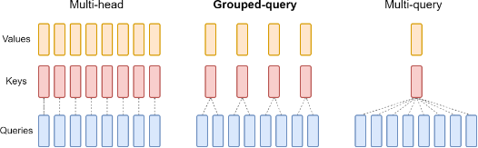

This repository implements several types of attention modules in PyTorch, including:

* Attention: The basic attention module
* Multi-head Attention: A multi-head attention module that performs attention on multiple different "heads"(each head is a set of Q, K, V) of the input sequence.
* Multi-Query Attention: A multi-query attention module that allows multiple queries and only one key, value to attend to the same input sequence.
* Grouped-Query Attention: A grouped query attention module that allows queries to be grouped together (each group include multiple queries and only one key) and attended to jointly.

  

`multi-query attention` and `grouped-query attention` modules is an alternative to `multi-head attention` with much lower memory bandwidth requirements. They has been used in many models, the most famous of which are:
* multi-query attention: [PaLM](https://arxiv.org/abs/2204.02311v5), [AlphaDev](https://www.nature.com/articles/s41586-023-06004-9), [AlphaZero](https://arxiv.org/pdf/1712.01815v1.pdf)
* grouped-query attention: [llama2](https://ai.meta.com/blog/llama-2/)

I implemented it in a simple way, with the purpose of understanding how attention works. It is an unoptimized version.
If you are looking for `attention` with better performance, I suggest:
* [flash attention](https://github.com/Dao-AILab/flash-attention)
* [torch.nn.functional.scaled_dot_product_attention](https://github.com/pytorch/pytorch/blob/main/torch/nn/functional.py#L4903)
* [huggingface](https://github.com/huggingface/transformers)

For more information, please see the following papers:
* Attention is All You Need [(Vaswani et al., 2017)](https://arxiv.org/abs/1706.03762)
* Fast Transformer Decoding: One Write-Head is All
You Need [(Noam Shazeer, 2019)](https://arxiv.org/pdf/1911.02150.pdf)
* GQA: Training Generalized Multi-Query Transformer Models from Multi-Head Checkpoints [(Ainslie et al., 2023)](https://arxiv.org/pdf/2305.13245.pdf)

I hope this helps!
